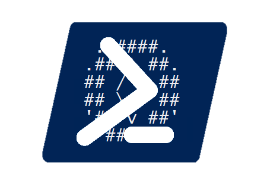
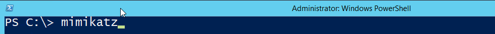

poshkatz
==================
 

poshkatz is a PowerShell module for Mimikatz that has a number of cool features!

**Brought to you by:**  
[Adam Driscoll](https://poshtools.com/)  
[Lee Berg](https://leealanberg.com/)


## Features ##

### Mimiktaz tab expansion "autocomplete"

Autocompletes mimikatz commands, parameters and paramter values.



### Cmdlet wrappers for Mimikatz features

- Export-MKKerberosTicket
- Get-MKCredentialVault
- Get-MKCredentialVaultCredential
- Get-MKKerberosTicket
- Get-MKLogonPassword
- Get-MKLsaCache
- Get-MKLsaSam
- Get-MKLsaSecret
- Get-MKTicket
- Grant-MKKerberosGoldenTicket
- Invoke-MKDcSync
- Invoke-MKPassTheHash

### Convert Mimikatz output into PowerShell Objects

```
PS C:\> mimikatz sekurlsa::logonpasswords exit | ConvertFrom-MKOutput -OutputType LogonPasswords


Domain           : Window Manager
NTLMHash         :
UserName         : DWM-1
SID              : S-1-5-90-1
Password         : (null)
LogonTime        : 10/16/2018 11:27:50 AM
SHA1Hash         :
LogonServer      : (null)
AuthenticationId : 0 ; 48064 (00000000:0000bbc0)
Session          : Interactive from 1

Domain           : IRONMAN
NTLMHash         :
UserName         : IRONMANDC1$
SID              : S-1-5-20
Password         : (null)
LogonTime        : 10/16/2018 11:27:50 AM
SHA1Hash         :
LogonServer      : (null)
AuthenticationId : 0 ; 996 (00000000:000003e4)
Session          : Service from 0
```

## Getting Started ##
1. Install git
1. Install posh-git
    > install-module posh-git
2. Build or Download a fresh copy of [mimikatz](https://github.com/gentilkiwi/mimikatz)
4. Import the poshkatz module
    > Import-Module poshkatz.psd1
5. Ensure mimikatz.exe is in your path
6. Have some fun
    > Get-MKLogonPassword

## Shout out ##

This project was heavily based on [posh-git](https://github.com/dahlbyk/posh-git).
